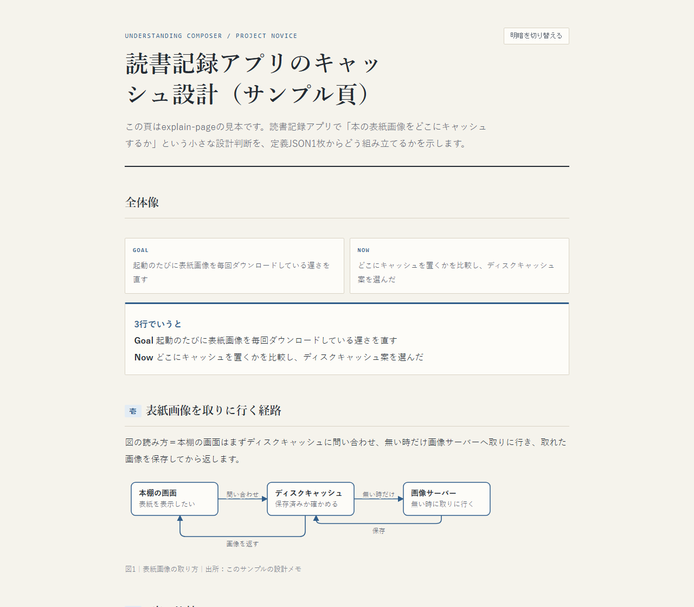

# explain-page

[](https://github.com/TakuyaSTND/explain-page/actions/workflows/test.yml)

*Explanation pages for coding agents: a strict renderer turns one JSON file into a
self-contained HTML page (hoverable glossary, diagrams, tables, evidence), and
hooks inspect every page before it counts as delivered. The English summary is at
the end; the rest of this document is in Japanese.*

エージェント（Claude Code／Codex／Hermes）が「人に見せる説明・報告・判断の頁」を、
手書きではなく正規のレンダラーで組み、検品（部品の目印・用語の説明・根拠の出所
など）まで自動で通すための道具一式です。



## できること

- 定義JSON（見出し・部品名・本文）1枚から、用語ホバー付きの1枚のHTMLを組む
  （`.claude/scripts/render_page.py`）。外部のフォント・画像・スクリプトは読み込まない。
- 頁の部品＝`overview`・`summary`・`walkthrough`・`examples`・`progress`・
  `visual`・`decision`・`evidence`・`glossary`・`details` の10種。
- 頁の中の塊＝`cards`・`diagram`（箱と矢印。配置と経路を自動計算）・`table`・
  `chart`（折れ線・棒）・`formula`（LaTeXの部分集合）・`quote`（原文・訳文・出所）・
  `diff`・`svg`（許可リストで組み直した手書きSVG）・`image`・`timeline`・
  `quadrant`・`venn`・`flow`・`score`・`compare`・`callouts`・`diagram_text`
  （1行記法から図を組む）など。書き方は `.claude/html-output.md` を見てください。
- 頁の検品＝部品の目印があるか・用語の説明が付いているか・根拠の出所が空でないか・
  見出しと中身がずれていないか、を機械で検査します。
- 用語集は「共通（`.claude/glossary-shared.md`）」と「プロジェクト固有
  （`.claude/glossary.md`）」の2階建てです。
- 読みやすさの否定側の規則（俗語・造語・不自然な言い回し）を、注記するだけで
  止めない形で検査します（`.claude/readability-rules.md`）。

## 動く環境

- Python 3.10 以上（頁を組む道具とフックは標準ライブラリだけで動きます）。
  Windows・macOS・Linux で自動試験を回しています。
- **フックで検品まで通すには Node.js と Playwright が要ります**。検品では、組んだ頁を
  実際のブラウザで開き、横にはみ出さないか・用語の説明が出るか・選択欄が動くかを
  確かめます（表示検査）。Playwright が無いと表示検査が「失敗」になり、フックは
  その頁を受け付けません。入れ方の例:

  ```
  npx -y playwright install chromium
  ```

  （Linux では `--with-deps` を付けると、ブラウザに要る部品も入ります）
- 任意＝Pillow（`image` の塊で画像を縮小・圧縮するときだけ使います。無ければ元の画像を
  そのまま貼ります）。
- 頁を組むだけ（`render_page.py` を手で走らせるだけ）なら Node.js と Playwright は
  無くても組めます。ただし表示検査が走らないので、結果は「不合格」と表示されます。

## 見本をすぐ見る

`examples/` に、組み上がった頁（`minimal_note.html`・`reading_tracker_cache.html`）と、
その元の定義JSONがあります。HTML はそのままブラウザで開けます。自分で組むときは:

```
python .claude/scripts/render_page.py examples/reading_tracker_cache.json
```

組んだ頁は一時フォルダの下の `explain-page/` に出ます（出力の最後に場所が表示されます）。
定義JSONの形は `.claude/html-output.md` と `render_page.py` の冒頭の説明にあります。

## 入れ方

### Claude Code（プラグイン）

Claude Code の中で:

```
/plugin marketplace add TakuyaSTND/explain-page
/plugin install explain-page@explain-page
```

**入れただけでは何も起きません**（安全の決まり）。使いたいプロジェクトで有効にするには、
このリポジトリを手元に置いて（`git clone`）、次を走らせます:

```
python plugins/explain-page/scripts/init_project.py <使いたいプロジェクトの根>
```

そのプロジェクトの `.claude/` に、設定（`visual-hook-policy.json`）と雛形
（`glossary.md`・`readability-rules.md`）が置かれます。既にあるファイルは上書きしません。
`.claude/visual-hook-policy.json` があるプロジェクトでだけ、フックが動きます。

プラグインを使わず、このリポジトリの `.claude/` を自分のプロジェクトへ写して直接つなぐ
こともできます。その場合は `.claude/hooks/adapters/claude-settings.fragment.json` の
中身を、そのプロジェクトの `.claude/settings.json` の hooks に足してください。

### Codex・Hermes（どちらも試験的）

このリポジトリを手元に置いた場所で:

```
python .claude/scripts/install_adapter.py --runtime codex  --project-root <使いたいプロジェクトの根> --write
python .claude/scripts/install_adapter.py --runtime hermes --project-root <使いたいプロジェクトの根>
```

Codex は `<使いたいプロジェクトの根>/.codex/hooks.json` に書きます（既にあって中身が違えば、
上書きせずに差分を出して止まります）。Hermes は設定ファイルの置き場が環境ごとに違うため、
埋めた内容を画面に出すだけです。出た内容を Hermes の設定ファイルへ貼ってください。
Codex には頁を公開する道具が無いので、Codex では頁を `render_page.py --runtime codex` で
組んでください（道具が検品の記録を代わりに書きます）。

## 安全の決まり

- プロジェクトに `.claude/visual-hook-policy.json` が無ければ、フックは何もせず終わります。
- プロジェクトの設定に、この仕組みを直接呼ぶ配線が既にあれば、プラグインの側は何もせず
  終わります（プラグインと直接の配線が両方走って二重に動くのを防ぐため）。
- Codex の検品の記録は、`--runtime codex` を明示したときだけ書きます。

## 開発

- 試験＝`python -m unittest discover -s .claude/hooks/tests`
- プラグインの作り直し＝`python .claude/scripts/build_plugin.py`（`--check` で一致を検査）。
  プラグインの中身（`plugins/explain-page/`）は `.claude/` から生成したものです。

## ライセンスと借用

MIT License（`LICENSE`）。読みやすさの規則は mathbullet/skills の ja-text-communication
（MIT）の原則を借用しています。詳しくは `THIRD_PARTY_NOTICES.md` を見てください。

---

## English summary

**explain-page** makes coding agents (Claude Code, and experimentally Codex and Hermes)
produce explanation pages through a strict renderer instead of hand-written HTML.

- **Render**: `python .claude/scripts/render_page.py page.json` turns one JSON spec into a
  single self-contained HTML page (no external fonts, images or scripts) with hoverable
  glossary terms, auto-laid-out box-and-arrow diagrams, tables, charts, formulas and an
  evidence table. See `examples/` for rendered pages and their specs.
- **Inspect**: hooks check each page (component markers, glossary coverage, evidence sources,
  heading/content mismatch) before the agent may finish its turn.
- **Install (Claude Code)**: `/plugin marketplace add TakuyaSTND/explain-page`, then
  `/plugin install explain-page@explain-page`, then enable it per project with
  `python plugins/explain-page/scripts/init_project.py <project-root>`. Nothing happens in a
  project without `.claude/visual-hook-policy.json`.
- **Codex / Hermes (experimental)**: `python .claude/scripts/install_adapter.py --runtime codex|hermes --project-root <project-root>`.
- **Requirements**: Python 3.10+ (standard library only). The hook inspection also opens every
  page in a real browser, so Node.js + Playwright are **required for the hooks**
  (`npx -y playwright install chromium`); without them the browser check fails and the page is
  not accepted. Pillow is optional (image resizing). Tested on Windows, macOS and Linux.
- The page text, readability rules and glossary are written for Japanese.
- **License**: MIT. Readability principles are borrowed from mathbullet/skills
  (ja-text-communication, MIT); see `THIRD_PARTY_NOTICES.md`.
